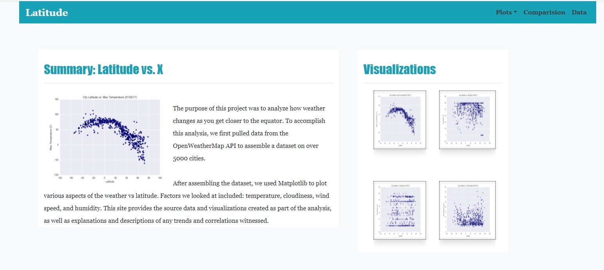
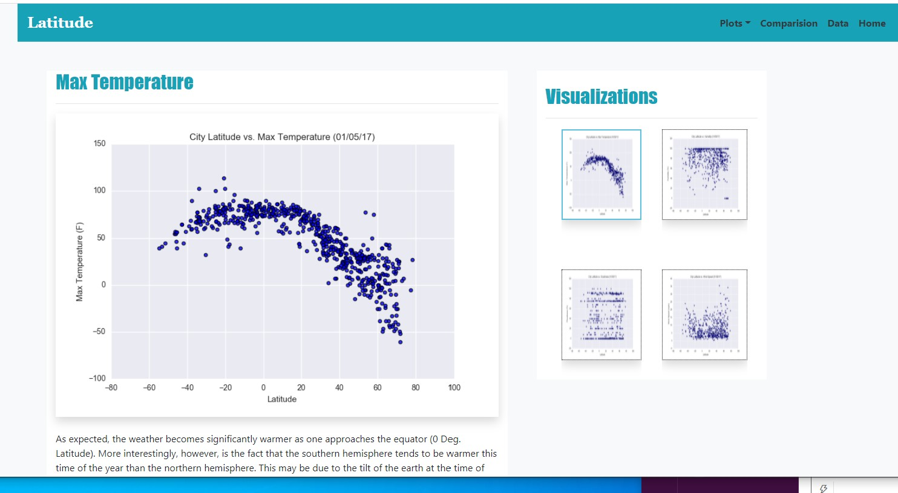
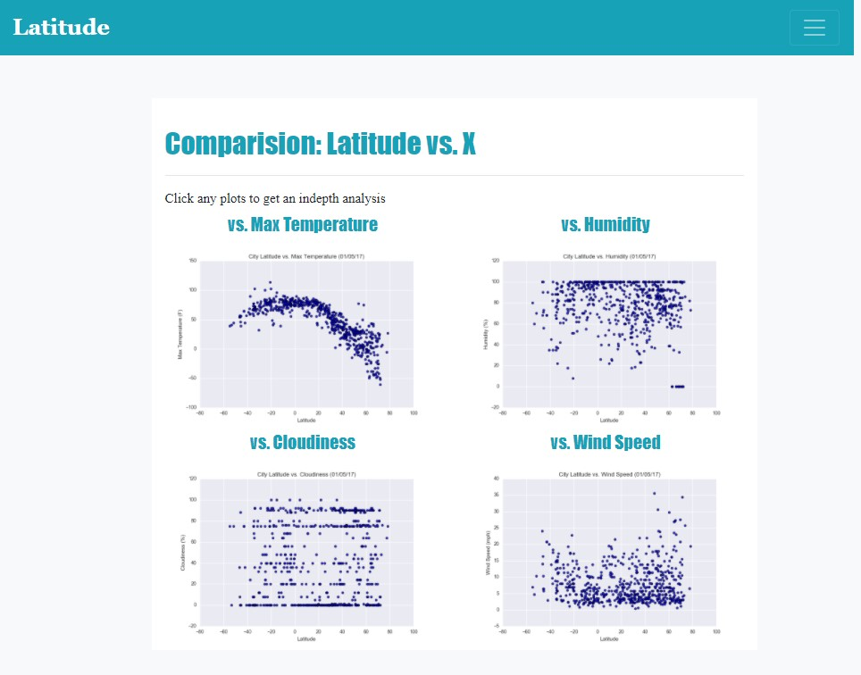
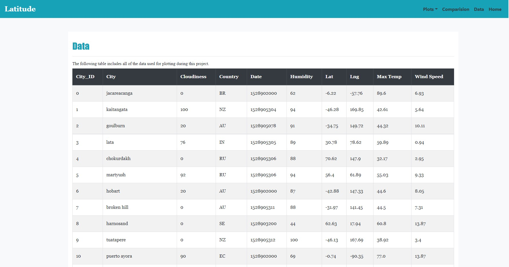

# Web-Design-Challenge
### Visualization dashboard website built with HTML, CSS and Bootstrap 


## [divya-gh.github.io/Web-Design-Challenge](https://divya-gh.github.io/Web-Design-Challenge/)



## Table of contents
* [Introduction ](#introduction )
* [Website Requirements](#website-requirements)
* [Screen Shots](#screen-shots)
* [Technologies](#technologies)
* [Code](#code)
* [Final Website](#website)
* [Status](#status)
* [Acknowledgement ](#acknowledgement )
* [Contact](#contact)


## Introduction
__Web Visualization Dashboard (Latitude)__  : *Data is more powerful when we share it with others! Let's take what we've learned about HTML and CSS to create a dashboard showing off the analysis we've done.*

### Website Requirements
 - The website must, at the top of every page, have a navigation menu that:
	- name of the site on the left of the nav.
	- dropdown menu on the right of the navbar named "Plots" that provides a link to each 
	  individual visualization page.
	- "Comparisons," which links to the comparisons page, and "Data," which links to the data page.
	- 'Home' link to return to the landing page from any page.

- The website must consist of 7 pages total, including:
	- __A landing page__ containing:
		- An explanation of the project.
		- Links to each visualizations page. There should be a sidebar containing preview images of each plot, and clicking an image should take the user to that visualization.

	- __Four visualization pages__, each with:
		- A descriptive title and heading tag.
		- The plot/visualization itself for the selected comparison.
		- A paragraph describing the plot and its significance.


	- __A "Comparisons" page__ that:
		- Contains all of the visualizations on the same page so we can easily visually 
		  compare them.
		- Uses a Bootstrap grid for the visualizations.

	- __A "Data" page__ that:
		- Displays a responsive table containing the data used in the visualizations.
		- The table must be a bootstrap table component. Hint
		- The data must come from exporting the .csv file as HTML, 

## Screen Shots
- __1. A landing page:__  
	            
      
                  
 

- __2.  Visualization pages:__ 

    
 
	 
- __3. A "Comparisons" page:__

 

 

- __4. A "Data" page:__

   


## Technologies
* git Bash
* VS editor
* Notepad++
* Chrome browser

### Python Modules and libraries
* os 
* csv


## Code 
- [Convert CSV to HTML using python](/csv_to_html.py)
- [ Main index.html](/index.html)
- [Other html files](/Resources/)

## Website
 https://divya-gh.github.io/Web-Design-Challenge



## Status
Project Complete

## Acknowledgement 
- google.com



## Contact
Created by [Divyashettyk@gmail.com](#divyashettyk@gmail.com)















